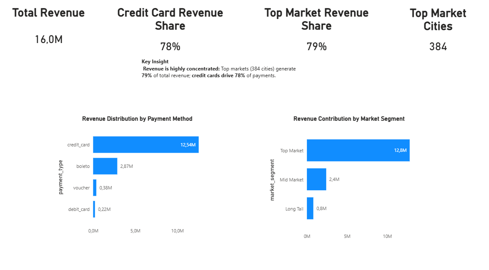
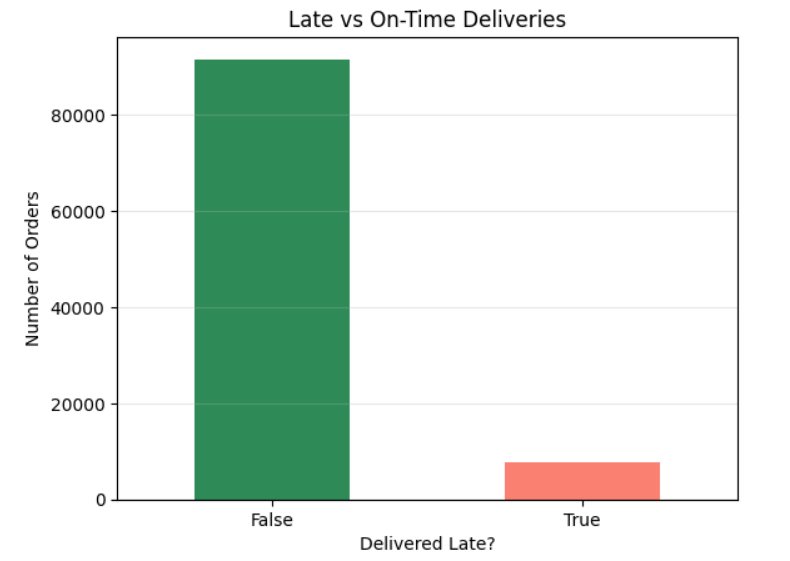
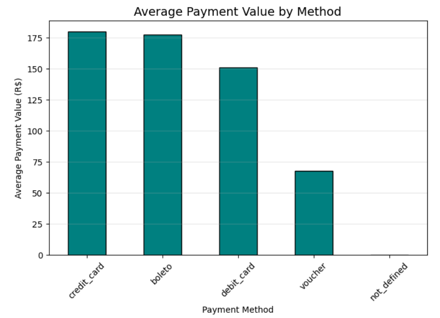

# Olist E-Commerce KPI Analysis (SQL → Python → Power BI)

## Overview
This project analyzes real-world e-commerce data from the Brazilian Olist marketplace to uncover revenue drivers, customer behavior, payment preferences, and retention patterns.

The analysis follows an end-to-end analytics workflow: SQL for data extraction, Python for analysis and segmentation, and Power BI for executive-level dashboarding.

---

## Dashboard Preview

### Key Insights from Dashboard
- **Revenue is highly concentrated:** Top markets (384 cities) generate **79%** of total revenue.
- **Payment dependency:** Credit cards account for **78%** of platform revenue.
- **Clear market segmentation:** Cities naturally cluster into Top, Mid, and Long Tail segments, enabling focused growth strategies.

---

## Business Questions Answered
- Which cities generate the highest revenue?
- Where is customer demand the strongest?
- How does Average Order Value (AOV) vary by city?
- Which payment methods drive most revenue?
- Which cities have the highest concentration of repeat customers?

---

## Dataset
- Brazilian E-Commerce Public Dataset (Olist)
- Relational data including customers, orders, and payments

---

## Tools Used
- SQL (SQLite)
- Python (Pandas)
- Google Colab
- Matplotlib / Seaborn

---

## KPIs & Analysis
- Total Revenue
- Total Orders
- Average Order Value (AOV)
- Revenue by City
- Orders by City
- Revenue by Payment Method
- Repeat Customer Concentration

---

## Key Business Insights
- São Paulo is the primary revenue and demand hub.
- Certain cities exhibit higher AOV, indicating premium purchasing behavior.
- Credit cards dominate platform revenue.
- Repeat customers are concentrated in specific cities, highlighting retention opportunities.

---

## Additional Analytical Insights

Below are deeper analytical takeaways from further exploration:

- Sales tend to peak during holiday periods and promotional windows.
- Delivery delays show correlation with lower customer review scores.
- Certain product categories with slower sales also have longer delivery times.
- Sales exhibit seasonal peaks and promotional boosts, indicating demand cycles that can inform marketing timing.
- Average delivery time is 10–12 days, with delays strongly associated with lower review scores — a key operational insight.
- Categories such as Housewares, Health & Beauty, and Furniture dominate revenue, while niche categories have slower sales and longer deliveries.
- Most 5-star reviews relate to timely deliveries; 1- and 2-star reviews often cite late delivery experiences.

---

## Additional Visual Analytics

Below are visual summaries that support deeper business understanding:

*Delivery delays are strongly associated with lower customer satisfaction ratings.*

*Payment behavior context to support the KPI finding that credit cards dominate revenue.*

## Business Impact
Insights from this analysis can support:
- Regional marketing optimization
- Logistics and fulfillment planning
- Checkout UX improvements
- Customer retention and loyalty strategies
